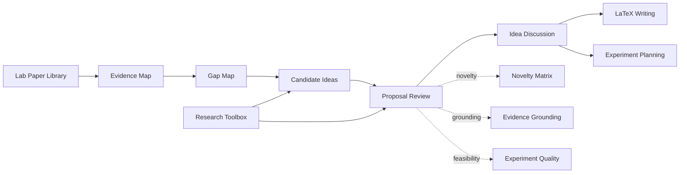
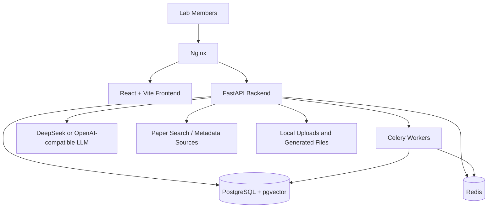

<h1 align="center">AstraLoom</h1>

<p align="center">
  <strong>Self-hosted AI research workspace for labs and research groups.</strong>
</p>

<p align="center">
  <a href="#quick-start">Quick Start</a> ·
  <a href="#features">Features</a> ·
  <a href="#workflow">Workflow</a> ·
  <a href="#architecture">Architecture</a> ·
  <a href="#中文说明">中文说明</a>
</p>

<p align="center">
  
  
  
  
  
</p>

AstraLoom helps a lab run its own private research platform: paper library, AI-assisted reading, idea generation, proposal review, toolbox reuse, LaTeX writing, and experiment planning in one self-hosted workspace.

It is designed for **each lab to deploy its own instance**, not as a centralized public SaaS product. Papers, notes, API keys, project discussions, and research directions stay under the lab's control.

## Why AstraLoom

Research groups often spread their work across Zotero folders, chat logs, paper PDFs, Overleaf projects, spreadsheets, and local scripts. AstraLoom turns those scattered research artifacts into a shared lab workspace:

- build a lab-owned paper knowledge base;
- generate and iterate research ideas from paper evidence;
- rank proposals with novelty, evidence grounding, toolbox fit, and experiment quality signals;
- move promising ideas into LaTeX writing and experiment planning;
- keep deployment, data, and model credentials inside the lab.

## Features

| Area | What AstraLoom provides |
| --- | --- |
| Paper Library | Import, search, classify, tag, mark important papers, read PDFs, and ask AI questions over selected text. |
| Research Workbench | Evidence Map, Gap Map, candidate pool, proposal ranking, idea discussion, and iterative refinement. |
| Review Signals | Novelty matrix, evidence grounding matrix, experiment quality evaluation, toolbox fit, and diversity-aware selection. |
| Toolbox | Store reusable methods, datasets, metrics, protocols, and tools discovered from papers. |
| Writing | Section-based LaTeX drafting, compile preview, BibTeX panel, citation suggestions, and AI writing assistance. |
| Lab Workspace | Shared project spaces with papers, research directions, writing projects, feedback issues, and an AI assistant. |

## Workflow



## Architecture



## Quick Start

```bash
git clone <repo-url>
cd AstraLoom
cp .env.example .env
docker compose up -d
```

Do not commit `.env`, API keys, uploaded papers, private notes, or database backups.

Open:

- Web app: http://localhost
- API docs: http://localhost/api/docs
- Health check: http://localhost/api/health
- Migration health: http://localhost/api/health/db

Apply or inspect migrations manually:

```bash
docker compose exec backend alembic upgrade head
docker compose exec backend alembic current
curl http://127.0.0.1:8000/api/health/db
```

## Model Configuration

DeepSeek:

```bash
LLM_PROVIDER=deepseek
DEEPSEEK_API_KEY=sk-your-deepseek-api-key
DEEPSEEK_API_BASE=https://api.deepseek.com
DEEPSEEK_MODEL=deepseek-v4-pro
```

OpenAI-compatible endpoint:

```bash
LLM_PROVIDER=openai-compatible
OPENAI_COMPATIBLE_API_KEY=sk-your-compatible-api-key
OPENAI_COMPATIBLE_API_BASE=https://your-compatible-endpoint/v1
OPENAI_COMPATIBLE_MODEL=gpt-5.5
```

If your endpoint supports the OpenAI Responses API, enable the matching model capability in settings.

## Repository Layout

```text
AstraLoom/
├── backend/              # FastAPI backend, DB models, services, Celery tasks
├── frontend/             # React frontend
├── nginx/                # Nginx configs
├── openspec/             # OpenSpec requirements and archived changes
├── docker-compose.yml    # Local/lab deployment
├── docker-compose.prod.yml
├── introduction.md       # Product introduction
├── user-manual.md        # User manual
└── README.md
```

## Development

Backend:

```bash
cd backend
pip install -r requirements.txt
uvicorn app.main:app --reload --port 8000
```

Frontend:

```bash
cd frontend
npm install
npm run dev
```

Build:

```bash
cd frontend
npm run build
```

Focused checks:

```bash
docker compose exec -T backend env PYTHONPATH=/app pytest tests/test_research_idea_workbench.py -q
node --test frontend/tests/research-toolbox-contract.test.mjs
openspec validate --specs --strict
```

## Deployment Notes

- Prefer deploying inside a lab network or a controlled server first.
- Configure HTTPS, backups, strong secrets, and access control before exposing the service externally.
- Use separate user accounts for lab members instead of sharing an admin account.
- Keep model API keys and paper data in environment variables, volumes, or private infrastructure.
- Keep private papers, uploads, logs, and database backups outside Git.

## License

No license file has been added yet. Before publishing as open source, confirm your lab or institution's policy and choose an appropriate license.

---

## 中文说明

AstraLoom 是面向课题组和实验室的自部署 AI 科研工作台。它不是一个给全网用户共用的公共 SaaS，而是希望每个实验室都能部署一套自己的系统，用来管理组内论文库、沉淀研究方向、辅助 idea 生成、评估 proposal、推进 LaTeX 写作和实验规划。

### 适合什么场景

- 课题组希望有一个统一的组内论文库，而不是每个人各自维护文献。
- 老师或学生希望从论文证据出发，系统化发现 Gap、生成 idea、比较 proposal。
- 组会需要更稳定地产出论文总结、重点论文标记和讨论材料。
- 实验室希望把工具、方法、数据集、指标和协议沉淀成可复用的工具箱。
- 写论文时希望把 proposal、证据卡、BibTeX、figures 和 LaTeX 章节连接起来。

### 核心能力

| 模块 | 能力 |
| --- | --- |
| 论文库 | 导入、检索、分类、标签、重点标记、PDF 阅读、划词问答 |
| 研究方向 | Evidence Map、Gap Map、候选 idea、proposal 排序、AI 讨论迭代 |
| 评审算法 | 新颖性矩阵、证据支撑矩阵、实验质量评估、工具适配、多样性选择 |
| 工具箱 | 沉淀论文里的方法、数据集、指标、协议和工具，并用于 idea 生成 |
| 写作助手 | 按章节写 LaTeX、编译预览、BibTeX 面板、引用建议、AI 辅助写作 |
| 项目空间 | 汇总论文、研究方向、写作项目、反馈 issue 和项目 AI 助手 |

### 中文快速开始

```bash
git clone <repo-url>
cd AstraLoom
cp .env.example .env
docker compose up -d
```

不要把 `.env`、真实 API Key、论文 PDF、用户上传文件、组内私有笔记或数据库备份提交到 Git。

访问：

- 前端界面：http://localhost
- API 文档：http://localhost/api/docs
- 健康检查：http://localhost/api/health
