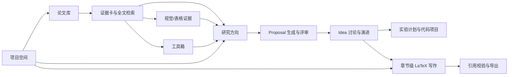
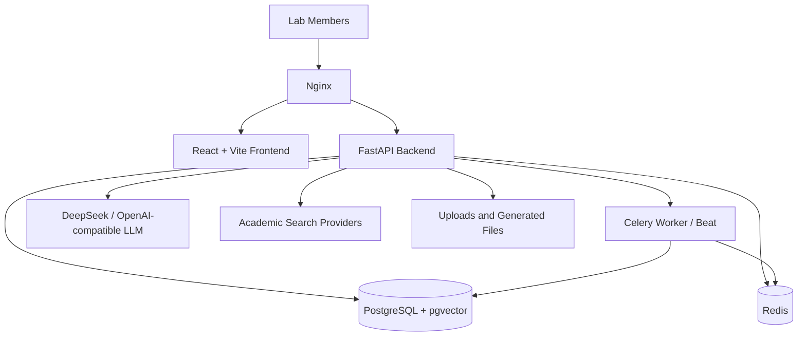

# AstraLoom 项目介绍

## 1. 项目定位

**AstraLoom** 是面向课题组和实验室的自部署 AI 科研工作台。它的目标不是做一个面向全网用户的公共 SaaS，而是让每个实验室可以部署一套自己的系统，用来管理组内论文、沉淀研究工具、生成和评审 research idea、推进 LaTeX 写作、组织项目空间，并把关键科研上下文留在实验室自己的基础设施中。

系统适合以下场景：

- 课题组希望维护一个共享论文库，而不是每位成员各自保存文献。
- 学生希望从论文证据出发，更系统地发现 gap、生成 proposal、比较方案。
- 导师希望看到 idea 的证据来源、实验可行性、风险和演进过程。
- 组会需要稳定地产出论文总结、重点论文标记、讨论材料和可复用报告。
- 写论文时希望把论文证据、BibTeX、figures、LaTeX 章节和 AI 辅助写作连接起来。
- 需要让论文问答不只读纯文本，还能把 PDF 中的图、表、caption 和页面区域作为可追溯证据。

## 2. 核心工作流

AstraLoom 的设计重点是“从论文证据到研究产出”的连续链路：

1. 先建立组内论文库，补全文、向量和分类。
2. 对 PDF 进行结构化解析，建立正文、章节、表格、caption、图表区域和视觉证据。
3. 把论文中的算法、数据集、指标、协议沉淀为工具箱。
4. 基于论文分类、种子论文和工具箱创建研究方向，生成有证据支撑的 proposal。
5. 对 proposal 做新颖性、证据支撑、实验质量、工具适配和多样性评估。
6. 将可行 idea 继续推进到实验计划、代码项目和论文写作。
7. 用项目空间把论文、方向、写作项目、反馈 issue 和团队成员组织在一起。

## 3. 主要模块

### 3.1 论文库

论文库是 AstraLoom 的知识底座。

主要能力：

- 多源论文搜索：本地库、arXiv、Semantic Scholar、OpenAlex、Google Scholar/SerpApi。
- 论文导入：支持搜索结果导入、arXiv 导入、BibTeX 导入和 Zotero CSV 导入。
- 论文分类：用户可以创建自定义分类/文件夹，把论文加入分类，并在研究方向创建时一键选择分类下的论文作为种子证据。
- 所属账号标签：论文入库时记录导入用户；历史论文可统一归到 `gst` 等指定账户，便于使用“我的”筛选。
- 本地检索：支持关键词检索、语义检索和混合检索。
- 检索维护：管理员可查看全文覆盖率、向量覆盖率、BM25 状态、视觉证据准备度，并诊断“为什么没命中”。
- 共享重点标记：可将论文标记为“重点论文”或“有趣论文”，所有成员可见，并可在论文库中筛选。
- 个人阅读状态：收藏、待读、阅读中、已读、个人笔记和注释。
- PDF 阅读：支持 PDF 代理、镜像缓存、划词问答、阅读上下文交互、结构化解析和图表视觉证据。
- 多模态论文问答：论文页 AI 问答会优先检索相关章节、表格、caption 和图表区域；回答引用可显示视觉证据卡片，并支持点击跳转到 PDF 页。
- 组会报告：可基于选定论文生成 Word 报告，并允许用户输入自定义报告要求替换默认 prompt。
- 论文推送：可按关键词和用户兴趣生成每日论文推送，在推送中心查看、反馈并选择是否入库。

### 3.2 AI 对话

通用对话模块提供多会话 AI 聊天能力。

主要能力：

- 支持 DeepSeek 和 OpenAI-compatible API 端点的模型切换。
- 支持 OpenAI Chat Completions 兼容端点；兼容端点支持 Responses API 时可展示 reasoning summary。
- 支持 RAG，将论文库检索结果注入回答上下文。
- 支持网络搜索增强，并按 quick / standard / deep 控制搜索深度。
- 支持文件上传：文本、PDF，以及对支持多模态的 GPT 兼容模型发送图片内容。
- 支持论文库 RAG 与联网增强同时开启，必要时自动切换到更深检索模式。
- Markdown、表格、代码块、数学公式和思考过程面板的前端渲染。
- Token 用量和费用估算按模型和用户归属统计；后台任务可归为 system。

### 3.3 工具箱

工具箱用于把论文中出现的可复用研究资产沉淀出来，而不是继续散落在论文详情或个人笔记中。

工具箱条目可以是：

- algorithm / method：算法、模型结构、训练方法。
- dataset：数据集或数据构造流程。
- metric：评价指标。
- protocol：实验协议、消融设计、标注流程。
- tool：软件工具、库、脚本或平台。

每个条目支持记录名称、类型、摘要、适用场景、局限、标签、成熟度，并可关联来源论文和证据说明。研究方向生成 idea 时可以选择工具箱条目，并要求模型参考、优先使用或规避这些工具。

### 3.4 研究方向与 Proposal 生成

研究方向模块负责把论文证据转化为可讨论、可评审、可迭代的 proposal。

当前流程包括：

- 分类种子：可从论文库自定义分类中选择一组论文作为方向证据，减少手动逐篇查找。
- 项目简报：根据方向名称、描述、关键词和种子论文生成背景简报。
- 证据检索：从本地论文库和外部学术源收集相关证据。
- Gap Map：把论文证据组织成研究空白和机会点。
- 候选生成：从 grounded、inspiration、seed refinement 等路径生成候选 idea。
- 去重和多样性控制：减少重复方案，保留不同研究路线。
- Proposal 评审：评估新颖性、证据支撑、可行性、可测试性、影响力和清晰度。
- 工具适配：分析选中工具箱条目和候选 proposal 的适配关系。
- 迭代演进：用户可与 AI 讨论 idea，加入反馈后生成可追溯的子版本。
- 实验计划和代码项目：为 idea 生成数据集、基线、指标、运行脚本和项目结构级代码包。

多次生成 proposal 不会覆盖原有结果，而是产生新的运行记录和新 proposal，便于比较不同批次的输出。

### 3.5 写作助手

写作助手面向真正的论文写作，而不是只生成一段孤立文本。

主要能力：

- 写作项目：以项目为单位组织论文草稿，可绑定研究方向、论文分类、目标会议/年份和写作类型。
- 章节级 LaTeX：每个章节可直接输入 LaTeX 源码。
- 合并预览：预览时合并多个章节，接近完整论文视图。
- 预览模式：支持单栏、双栏和模板样式。
- 投稿模板：写作项目可记录目标会议、年份、官方模板元数据和编译设置。会议格式每年可能变化，因此系统更适合作为模板资料和导出准备检查工具，而不是保证替代官方模板。
- LaTeX 提示：输入 `\` 后提供常用命令建议，例如 `\cite{}`、`\ref{}`、`\section{}`。
- BibTeX 面板：从已有证据卡生成 `references.bib`，支持查看、复制和引用。
- figures 面板：维护图表清单，并生成可插入章节的 LaTeX 片段。
- 证据到草稿：可从研究方向、论文分类和证据卡创建综述/论文草稿，生成 Related Work 对比表，并区分支持证据、反例和 baseline。
- AI 辅助写作：可在章节上下文中唤出 AI 进行扩写、润色、改写和引用建议。
- 引文验证：对 AI 生成的引用进行知识库交叉验证，检查引用是否真实存在、是否与句子匹配，降低虚假引用风险。
- 导出：支持 LaTeX、Markdown、BibTeX、Word 等导出路径，具体可用性取决于部署环境中的 LaTeX/Word 依赖。

服务端 LaTeX 编译依赖 `pdflatex`。如果部署环境缺少 TeX 发行版，源码编辑仍可使用，但 PDF 编译预览会失败。

### 3.6 项目空间

项目空间用于把一个课题或子方向相关的资源聚合到一起。

主要能力：

- 空间成员：owner / editor / viewer 三种角色。
- 资源绑定：论文、研究方向、写作项目都可以加入空间。
- 活动记录：记录成员变动、资源绑定、内容更新等操作。
- 推进看板：展示论文数、方向数、写作项目数、进度和下一步建议。
- 反馈 issue：像 GitHub issue 一样收集项目问题、建议和待办反馈。
- 项目 AI 助手：基于当前空间上下文协助讨论，支持 Markdown 渲染和可折叠上下文。

### 3.7 行动中心与设置

行动中心会扫描论文库、研究方向、写作项目和项目空间，给出下一步建议，例如补全文、补向量、继续阅读、创建方向、推进写作等。

设置中心包含：

- 个人资料和密码。
- API / 模型配置展示。
- 界面语言切换。当前全局导航、系统控件和 Ant Design 组件支持中英文切换，业务页面文案会逐步接入。
- Token 用量、调用历史和费用估算。
- 论文推送订阅、测试推送和每日定时推送。
- 管理员知识库维护入口，包括全文、向量、结构化 PDF、图表视觉证据、检索诊断和低覆盖率提示。

## 4. 技术架构

### 4.1 后端

- Python 3.12
- FastAPI
- SQLAlchemy 2 async ORM
- Alembic migrations
- PostgreSQL 16 + pgvector
- Redis
- Celery worker / beat
- LiteLLM
- PDF parsing with pdfplumber / PyMuPDF / pikepdf
- PDF visual evidence extraction with PyMuPDF crops and optional vision-model summaries
- Word export with python-docx

### 4.2 前端

- React 19
- TypeScript
- Vite 8
- Ant Design 6
- Zustand
- React Router
- Axios
- react-markdown / remark-gfm / rehype-katex
- react-pdf / pdfjs-dist

### 4.3 部署

默认使用 Docker Compose：

- `postgres`
- `redis`
- `backend`
- `celery-worker`
- `celery-beat`
- `frontend`
- `nginx`

开发环境使用 `docker-compose.yml`，生产环境可叠加 `docker-compose.prod.yml`。数据库迁移由 Alembic 管理，部署后应确认迁移已到最新版本。

论文库向量检索使用本地 `sentence-transformers` 模型，首次补向量时会下载 `all-MiniLM-L6-v2`。系统默认通过 `HF_ENDPOINT=https://hf-mirror.com` 访问 HuggingFace 兼容镜像；如需使用其他镜像，可在 `.env` 中覆盖该变量。后端和 worker 会把模型缓存写入 Docker volume `model_cache`，下载成功后重启或重建容器仍可复用。

## 5. 数据边界与 GitHub 上传边界

AstraLoom 面向实验室私有部署，因此代码仓库和运行数据需要清晰分离。

可以放到 GitHub 的内容：

- 源码。
- OpenSpec 规格和归档变更。
- README、介绍文档、用户手册。
- 示例配置，例如 `.env.example`。
- 测试和开发脚本。

不应该提交到 GitHub 的内容：

- `.env` 和真实 API Key。
- 上传的论文 PDF、用户文件、生成文件和 `uploads` 数据。
- PostgreSQL / Redis 数据目录。
- 数据库备份。
- 私有笔记、组内未公开材料和日志。
- 真实用户账号、Token 或调用记录。

推荐做法：

- 用环境变量或私有密钥管理系统保存模型 API Key。
- 用 Docker volume 或服务器私有目录保存上传文件和数据库数据。
- 服务器上的 PostgreSQL、Redis、Docker volumes、`uploads/`、`backend/model-cache/`、`.env` 都视为生产数据或运行态缓存，不随代码覆盖。
- 从本地上传新版本到 GitHub 或服务器时，只上传源码、配置模板、OpenSpec、文档和前端/后端代码；不要上传本地运行产生的 `uploads/`、`dist/`、`node_modules/`、模型缓存和日志。
- 如果通过网页或图形化工具手动上传文件到服务器，先在服务器上备份当前目录，上传时选择“覆盖代码文件但不覆盖数据目录”，并在上传后执行数据库迁移和容器重启。
- 对生产实例启用 HTTPS、强 `SECRET_KEY`、备份和访问控制。
- 对外开放前先确认实验室、导师或机构对论文和数据的合规要求。

### 5.1 推荐的安全发布边界

如果 GitHub 上当前是服务器版本，而你想把本地开发版本上传上去，安全原则是：

1. **代码覆盖，数据不覆盖**：GitHub 仓库只保存代码和规格，服务器数据库与上传文件继续留在服务器。
2. **不要上传 `.env`**：服务器继续使用自己的 `.env`，本地只提交 `.env.example`。
3. **不要上传 `uploads/` 和 Docker volume**：论文 PDF、视觉裁剪图、用户头像、生成文件、模型缓存都属于运行数据。
4. **先备份再替换代码**：手动上传前在服务器复制一份当前项目目录，至少保留 `.env`、`uploads/` 和数据库备份。
5. **上传后执行迁移**：代码变更可能包含 Alembic migration，服务器更新代码后需要执行 `alembic upgrade head`。

更推荐的发布方式是：本地提交代码到 GitHub，服务器通过 `git pull` 更新代码；如果暂时只能手动上传，也应只上传代码文件，并显式排除数据目录。

## 6. 开发方法

项目采用 OpenSpec 规范驱动开发。新增功能、重要行为变化和较大算法调整都应先建立 change：

1. 写清楚为什么要改。
2. 在 spec 中描述用户可观察行为。
3. 在 tasks 中拆解实现步骤。
4. 实现、验证、提交。
5. 完成后归档 change，并同步主规格。

这能减少功能膨胀，也方便回溯每个设计决策。

## 7. 当前重点方向

项目已经具备较多功能，后续优化更适合优先放在质量和算法上：

- 提高论文检索与 RAG 命中质量。
- 提高 proposal 生成的证据约束和去重质量。
- 优化工具箱在 idea 生成中的使用策略。
- 加强引用验证、BibTeX 生成和写作预览的稳定性。
- 改善长任务的进度反馈、超时恢复和错误提示。
- 继续压缩复杂页面的认知负担，让核心工作流更清晰。

## 8. 总结

AstraLoom 的核心价值不是简单地把聊天、论文、写作功能堆在一起，而是把实验室日常科研中的关键对象连接起来：论文、证据、工具、idea、proposal、实验、章节、项目空间和团队反馈。部署在实验室自己的环境中后，它可以成为组内长期积累研究上下文和推进科研产出的工作台。
